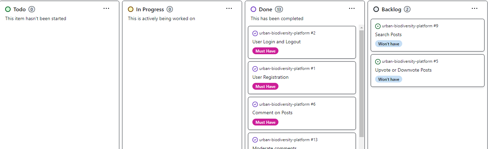

# Urban Biodiversity Platform

Link to live website: [CLICK HERE!](https://ubp-7ea7f2ca1a6d.herokuapp.com/)


Welcome to **Urban Biodiversity Platform** a blog dedicated to fostering a community passionate about urban ecology and biodiversity. Our mission is to raise awareness, spark conversations, and promote collaboration around the importance of preserving and enhancing the rich biodiversity in our urban environments.

- - -

## UX
The theme of the project is urban biodiversity, so I wanted to use a color palette that gives an eco-friendly and sustainable vibe.

### Colour Scheme
I used [coolors.co](https://coolors.co/e84610-009fe3-4a4a4f-445261-d63649-e6ecf0-000000) to generate my colour palette.


I've also used CSS `:root` variables to easily update the global colour scheme.

```css
:root{

    /*Colours*/
    --color-primary: #535832;
    --color-secondary: #95A968;
    --color-accent: #f0c965;
    --color-text: #444;
    --color-background: #e4e4e4;
    --color-background-main: #fefeff;    
    --color-bark: #795548;
    --color-sky: #4eb8d8;
    --color-btn-primary: #1587aa;
    --color-earth: #8D6E63;
    --color-delete: #d9534f;
    --color-white: #ffffff;
    --color-grey: #bbbbbb;
```

### Typography
I used [Merriweather](https://fonts.google.com/specimen/Merriweather) for all text in various font-sizes and weights. 
Reasons why I chose Merriweather:
- I find that Merriweather's readability and elegance ensures that the content is easy to digest, which is crucial for longer articles like the ones on this project.

- - -

## User Stories
I created the user stories in the beginning of the project so that I could better organize the structure of the site. 
Some of the stories were adjusted during the working process, so as to better fit my final ideas.
| Title | User Story | MoSCoW Priority | 
| --- | --- | --- |
| User Login and Logout | As a **registered user** I want to **log in using my username and password** so that I can **access my personalized content.** | Must Have |
| User Registration | As a **new user** I want to **register a new account** so that I can **interact with posts by commenting.** | Must Have |
| Comment on Posts | As a **registered user** I want to **comment on posts** so that I can **participate in discussions and provide feedback.** | Must Have |
| Moderate comments | As a **site admin** I want to **moderate comments, including editing and deleting comments** so that I can **manage community interactions and discussions.** | Must Have |
| Manage Posts | As a **site admin** I want to **moderate posts, including creating, updating, and deleting posts** so that I can **maintain content quality and relevance.** | Must Have |
| Create a new post | As a **site admin** I want to **create a new post by entering a title and content** so that I can **share new content with others.** | Must Have |
| Manage User Accounts | As a **site admin** I want to **manage users, including editing and deleting user accounts** so that I can **ensure the integrity and safety of the community.** | Must Have |
| View All Posts by Category | As a **registered user** I want to **view posts grouped in different categories** so that I can **read and explore the content more easily.** | Must Have |
| Manage Categories | As a **registered user** I want to **manage my own categories, including adding, editing, and deleting categories** so that I can **contribute to the content of the platform.** | Should Have |
| Manage Categories | As a **site admin** I want to **manage all categories, including adding, editing, and deleting categories** so that I can **organize content effectively.** | Should Have |
| Search categories | As a **site admin** I want to **search through the various post categories** so that I can **find the posts that I'm more interested in.** | Should Have |
| Update About Page Content | As a **site admin** I want to **view and edit the About page** so that I can **update information about the website.** | Could Have |
| View About Page | As a **new user** I want to **view the About page** so that I can **learn more about the website and its purpose.** | Could Have |
| Search posts | As a **new user** I want to **be able to search for posts by title or content** so that I can **easily find what I'm most interested in.** | Won't Have |
| Upvote or Downvote Posts | As a **registered user** I want to **be able to upvote or downvote posts** so that I can **express my opinion on the content quality.** | Won't Have |

- - -

## Agile Development Process

### GitHub Projects
[GitHub Projects](https://github.com/KikiBerg/urban-biodiversity-platform/projects?query=is%3Aopen) was used as an Agile tool for this project.
There are probaply more ideal tools out there, but for now it served its purpose.
I used this tool for planning my user stories & issues, then followed up now and then using the Kanban board. 


### GitHub Issues
[GitHub Issues](https://github.com/KikiBerg/urban-biodiversity-platform/issues) was also used as an Agile tool.
I created my own **User Story Template** in order to manage the user stories.

- [Open Issues](https://github.com/KikiBerg/urban-biodiversity-platform/issues?q=is%3Aissue+is%3Aopen)
I placed these to a **Backlog** column as they are features that were not prioritized and are seen as possible future implementations.

- [Closed Issues](https://github.com/KikiBerg/urban-biodiversity-platform/issues?q=is%3Aissue+is%3Aclosed+) 

### MoSCoW Prioritization

I've prioritized my user stories using this method and used labels for my user stories within the Issues tab.

- **Must Have**: guaranteed to be delivered 
- **Should Have**: adds significant value, but not vital 
- **Could Have**: has small impact if left out 
- **Won't Have**: not a priority for this iteration

- - -

## Features

### Existing Features

### Future Features

- - -

## Tools & Technologies

- - -

## Database Design

- - -

## Testing

> [!NOTE]  
> For all testing, please refer to the [TESTING.md](TESTING.md) file.

- - -

## Deployment

The live deployed application can be found deployed on [Heroku](https://ubp-7ea7f2ca1a6d.herokuapp.com/)

### PostgreSQL (Code Institute)
This project uses [PostgreSQL from Code Institute](https://dbs.ci-dbs.net/) for the PostgreSQL Database.

### Cloudinary API

### Heroku Deployment

### Local Deployment

### Local VS Deployment

- - -

## Credits

### Content

### Media

### Acknowledgements

