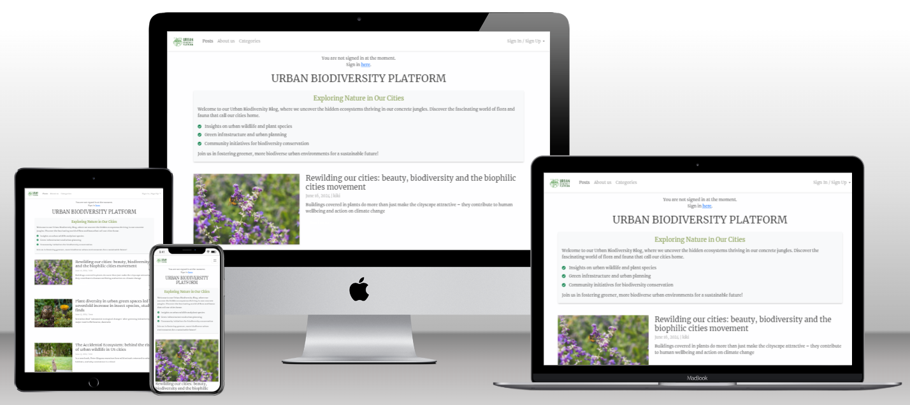

# Urban Biodiversity Platform

Link to live website: [CLICK HERE!](https://ubp-7ea7f2ca1a6d.herokuapp.com/)

Creator: Angeliki (Kiki) Vlachou

Welcome to **Urban Biodiversity Platform** a blog dedicated to fostering a community passionate about urban ecology and biodiversity. Our mission is to raise awareness, spark conversations, and promote collaboration around the importance of preserving and enhancing the rich biodiversity in our urban environments.

## UX

### Colour Scheme

### Typography

## User Stories

## Features

### Existing Features

### Future Features

## Tools & Technologies

## Database Design

## Agile Development Process

### GitHub Projects

### GitHub Issues

### MoSCoW Prioritization

## Testing

> [!NOTE]  
> For all testing, please refer to the [TESTING.md](TESTING.md) file.

## Deployment

The live deployed application can be found deployed on [Heroku](https://ubp-7ea7f2ca1a6d.herokuapp.com/)

### PostgreSQL (Code Institute)
This project uses [PostgreSQL from Code Institute](https://dbs.ci-dbs.net/) for the PostgreSQL Database.

### Cloudinary API

### Heroku Deployment

### Local Deployment

### Local VS Deployment

## Credits

### Content

### Media

### Acknowledgements

