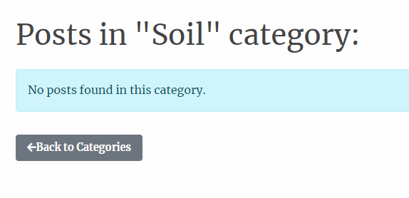

# Urban Biodiversity Platform

Link to live website: [CLICK HERE!](https://ubp-7ea7f2ca1a6d.herokuapp.com/)


Welcome to **Urban Biodiversity Platform** a blog dedicated to fostering a community passionate about urban ecology and biodiversity. Our mission is to raise awareness, spark conversations, and promote collaboration around the importance of preserving and enhancing the rich biodiversity in our urban environments.

- - -

## UX
The theme of the project is urban biodiversity, so I wanted to use a color palette that gives an eco-friendly and sustainable vibe.

### Colour Scheme
I used [coolors.co](https://coolors.co/e84610-009fe3-4a4a4f-445261-d63649-e6ecf0-000000) to generate my colour palette.


I've also used CSS `:root` variables to easily update the global colour scheme.

```css
:root{

    /*Colours*/
    --color-primary: #535832;
    --color-secondary: #95A968;
    --color-accent: #f0c965;
    --color-text: #444;
    --color-background: #e4e4e4;
    --color-background-main: #fefeff;    
    --color-bark: #795548;
    --color-sky: #4eb8d8;
    --color-btn-primary: #1587aa;
    --color-earth: #8D6E63;
    --color-delete: #d9534f;
    --color-white: #ffffff;
    --color-grey: #bbbbbb;
```

### Typography
I used [Merriweather](https://fonts.google.com/specimen/Merriweather) for all text in various font-sizes and weights. 
Reasons why I chose Merriweather:
- I find that Merriweather's readability and elegance ensures that the content is easy to digest, which is crucial for longer articles like the ones on this project.

- - -

## User Stories
I created the user stories in the beginning of the project so that I could better organize the structure of the site. 
Some of the stories were adjusted during the working process, so as to better fit my final ideas.
| Title | User Story | MoSCoW Priority | 
| --- | --- | --- |
| User Login and Logout | As a **registered user** I want to **log in using my username and password** so that I can **access my personalized content.** | Must Have |
| User Registration | As a **new user** I want to **register a new account** so that I can **interact with posts by commenting.** | Must Have |
| Comment on Posts | As a **registered user** I want to **comment on posts** so that I can **participate in discussions and provide feedback.** | Must Have |
| Moderate comments | As a **site admin** I want to **moderate comments, including editing and deleting comments** so that I can **manage community interactions and discussions.** | Must Have |
| Manage Posts | As a **site admin** I want to **moderate posts, including creating, updating, and deleting posts** so that I can **maintain content quality and relevance.** | Must Have |
| Create a new post | As a **site admin** I want to **create a new post by entering a title and content** so that I can **share new content with others.** | Must Have |
| Manage User Accounts | As a **site admin** I want to **manage users, including editing and deleting user accounts** so that I can **ensure the integrity and safety of the community.** | Must Have |
| View All Posts by Category | As a **registered user** I want to **view posts grouped in different categories** so that I can **read and explore the content more easily.** | Must Have |
| Manage Categories | As a **registered user** I want to **manage my own categories, including adding, editing, and deleting categories** so that I can **contribute to the content of the platform.** | Should Have |
| Manage Categories | As a **site admin** I want to **manage all categories, including adding, editing, and deleting categories** so that I can **organize content effectively.** | Should Have |
| Search categories | As a **site admin** I want to **search through the various post categories** so that I can **find the posts that I'm more interested in.** | Should Have |
| Update About Page Content | As a **site admin** I want to **view and edit the About page** so that I can **update information about the website.** | Could Have |
| View About Page | As a **new user** I want to **view the About page** so that I can **learn more about the website and its purpose.** | Could Have |
| Search posts | As a **new user** I want to **be able to search for posts by title or content** so that I can **easily find what I'm most interested in.** | Won't Have |
| Upvote or Downvote Posts | As a **registered user** I want to **be able to upvote or downvote posts** so that I can **express my opinion on the content quality.** | Won't Have |

- - -

## Structural Design

### Content Structure:
- **Posts:** Includes a welcoming section offering a site summary and a collection of posted articles.
- **Post Detail Pages:** In-depth content on featured articles, including a comment area. Limited access for non-registered users, allowing only comment viewing.
- **About Us Page:** A comprehensive description of the site's purpose and a contact form for communication.
- **Categories:** Showcasing all available blog categories. Restricted access for non-registered users.
- **Categories Post List Pages:** Presenting a collection of articles belonging to a specific category. Limited access for non-registered users.
- **Sign Up and Sign In Pages:** User registration and sign in pages providing enhanced access to commenting and category features.

### Interface Design:
- **Adaptive layouts** for optimal performance on various devices.
- **Engaging components** like buttons, links, and forms developed with a focus on user-friendliness.
- **Visual indicators** (symbols, color transitions) to enrich interactive elements and boost user satisfaction.

- - -

## Wireframes


- - -

## Agile Development Process

### GitHub Projects
[GitHub Projects](https://github.com/KikiBerg/urban-biodiversity-platform/projects?query=is%3Aopen) was used as an Agile tool for this project.
There are probaply more ideal tools out there, but for now it served its purpose.
I used this tool for planning my user stories & issues, then followed up now and then using the Kanban board. 


### GitHub Issues
[GitHub Issues](https://github.com/KikiBerg/urban-biodiversity-platform/issues) was also used as an Agile tool.
I created my own **User Story Template** in order to manage the user stories.

- [Open Issues](https://github.com/KikiBerg/urban-biodiversity-platform/issues?q=is%3Aissue+is%3Aopen):
I placed these to a **Backlog** column as they are features that were not prioritized and are seen as possible future implementations.

- [Closed Issues](https://github.com/KikiBerg/urban-biodiversity-platform/issues?q=is%3Aissue+is%3Aclosed+) 

### MoSCoW Prioritization

I've prioritized my user stories using this method and used labels for my user stories within the Issues tab.

- **Must Have**: guaranteed to be delivered 
- **Should Have**: adds significant value, but not vital 
- **Could Have**: has small impact if left out 
- **Won't Have**: not a priority for this iteration

- - -

## Features

### Existing Features

> **Sign Up & Sign In**
- These features are placed separately to the right side of the navigation bar for easier orientation. There is a dropdown menu for choosing to either sign in or sign up.
- Depending on whether the user has already an account or not, they should either sign in or sign up. By clicking on either the "Sign In" or the "Sign Up" button, they are respectively redirected to the sign in or the sign up form pages. 
- The users are also informed if they are or not signed in at the moment. This information is active on all pages. There's a link to the Sign In form page in this case.
- When signed in, there is an informative section on the top of each page, reminding of the actual/active username.


> **Sign Out**
- In case the user wants to sign out they will be asked to confirm that decision. If they click on the "Sign out" button they will be signed out.


> **Navigation Bar**
- The navigation bar ensures convenient access to all site areas, adapts to various display resolutions, and incorporates user authentication features as documented right above (Sign In, Sign Up). It consists of the three main pages, Posts - About us - Categories


> **Posts page**
- This page has the same content for all users (admin, registered & non-registered users).
- It includes a welcoming section offering a site summary and a collection of posted articles.
- The posts list section shows the collection of posted articles.
- On the left side you can find the post image (ca 1/3 of the width). To the right of the image there's the post title, the date it was posted, the author as well as a short excerpt that gives a hint of what the post is about.
- At the bottom of the page there's a page pagination feature for better orientation throughout the different post pages. There's a limit of 3 posts per page.
- By clicking on the title of the post, the user is directed to the detail page of that post.


> **Posts Detail Pages**
- This page has a slightly different content depending on the authentication status of the user.
- The **general common features** for all users regardless auth status are:
    - You can see the title, author, date and category of the post.
    - You can see the image of the post (same as on the previous post list page).
    - You can read the content of the article.
    - You can see the number of comments left at the end of the article.
    - You can read the comments left (only the approved ones, marked with a green colour.) 
    - You can see a card informing you that you can leave a comment. This card informs you also about your auth status and gives you the link to the Sign In page.
    
    <details>
    <summary>Click to see a whole post detail page as described above</summary>
    
    
    </details>

- As a **registered user**, you have access to the above mentioned features. The **additional** ones are:
    - You can create, update & delete your own comments.
    - You can see the status of the category that the post belongs to (Approved (green), Pending (yellow)).    
    - After updating your comment you can see this message: "*Comment Updated! Our admin needs to approve this change first. Your updated comment will show again after that approval.*". Your message will appear again only if the admin approves the change you made.
    
    <details>
    <summary>Click to see a whole post detail page as described above</summary>
    
    
    </details>

- As a **site admin**, you have access to **all** the above mentioned features (meaning the site admin can do everything a registered & a non-registered user can). The **additional** ones are:
    - You can see & manage all the comments left regardless of status (approved ones are green, pending ones are yellow).
        
    <details>
    <summary>Click to see a whole post detail page as described above</summary>
    
    
    </details>

> **About & Contact**
- This page has the same content for all users (admin, registered & non-registered users).
- The About us section provides a comprehensive description of the site's purpose.
- At the bottom of that section the user can see when that section was created & updated.
- At the bottom of the page there is a contact form for communication with the site admin.
- When the user submits a message, they get this information: "*Your message has been received! We'll get back to you soon.*"
    
    <details>
    <summary>Click to see a whole about page as described above</summary>
    
    
    </details>

> **Categories Page**
- This page has a slightly different content depending on the authentication status of the user.
- The **general common features** for all users regardless auth status are:
    - You get information about your authentication status and are given the link to the Sign In page if that's the case.
    - You can see the title of the page "Categories" at the top.
    - You can search for a category using the search form.
    - You can see a list of all the approved categories including title & description of the categories.
    - You can click on the categories and get directed to the separate category post list page, showcasing if there are any posts belonging to that specific category.
    - You can see the title of the post belonging to that category, as well as the excerpt, the date it was posted & the name of the author who wrote that post.
    - You can click on the "Back to Categories" button and get redirected to the main Categories page.
    
    

- As a **registered user**, you have access to the above mentioned features. The **additional** ones are:
    - You can create, update & delete your own categories.    
    - You can still see only the approved categories but a badge informing you of the category status is now visible: "Approved" (green).
    - After creating or updating your category you can see this message: "*This category is awaiting approval.*" and "*Category updated successfully!Changes are pending approval.*"
    
    <details>
    <summary>Click to see a whole category page as described above</summary>
    
    
    </details>    

- As a **site admin**, you have access to **all** the above mentioned features (meaning the site admin can do everything a registered & a non-registered user can). The **additional** features are:
    - You can see & manage all the categories regardless of status (approved ones are green, pending ones are yellow, rejected are red).
    - You can activelly change the status of the categories from that page.
    - The changes will even appear on the category badge at the post detail page too.
    - As you have access to all of the categories (meaning there's more content shown now on the page), the content gets divided to multiple pages through page pagination right at the bottom.

    <details>
    <summary>Click to see a whole category page as described above</summary>
    
    
    </details>

### Future Features

- Many-to-many relationship between posts & categories: In the future I would like to make it possible to apply several categories to the posts. Right now, a post can belong to only one category.
- Show only posts that belong to approved categories: In the future I would like to make the necessary changes so that non-registered users can only see posts that belong to approved categories when on Posts main page.
- Upvoting & Downvoting: I've added these fields in my Post model, but due to lack of time I haven't implemented them. In the future I would like to make it possible for authenticated users to be able to upvote or downvote a post.
- Category delete: Right now, a registered user can delete their own categories without approval from the site admin. (Approval from site admin is currently only needed when creating & updating their own categories). In the future I would like to add extra security so that the admin approves the deletion too. That is seen as a minor feature, as the registered users have crud only for their own categories & as mentioned their new categories or their changes need to be approved first by the site admin.
- Navigation: I would like to add a button at the end of the post detail page, making it easier to navigate back to the main posts page if the user wants to.
- Media in posts: I would like to be able to add pictures & links inside the posts so as to make the reading experience more pleasant. (I had this implemented in the Django interface via Summernote, but was getting several errors when validating, so I decided to take them away for now.)

- - -

## Tools & Technologies
- [PostgreSQL from Code Institute](https://dbs.ci-dbs.net/) was used as the relational database management.
- [](https://git-scm.com) used for version control. (\`git add\`, \`git commit\`, \`git push\`)
- [](https://github.com) used for secure online code storage.
- [](https://gitpod.io) used as a cloud-based IDE for development.
- [](https://en.wikipedia.org/wiki/HTML) used for the main site content.
- [](https://en.wikipedia.org/wiki/CSS) used for the main site design and layout.
- [](https://www.javascript.com) used for user interaction on the site.
- [](https://www.python.org) used as the back-end programming language.
- [](https://www.heroku.com) used for hosting the deployed back-end site.
- [](https://getbootstrap.com) used as the front-end CSS framework for modern responsiveness and pre-built components.
- [](https://www.djangoproject.com) used as the Python framework for the site.
- [](https://cloudinary.com) used for online static file storage.
- [](https://whitenoise.readthedocs.io) used for serving static files with Heroku.
- [](https://balsamiq.com/wireframes) used for creating wireframes.
- [](https://fontawesome.com) used for the icons.

- - -

## Database Design
Entity Relationship Diagrams (ERD) aid in conceptualizing the skeleton of a database prior to creating the models. 
- Identifying the connections among various tables at the initial stages contributes to time efficiency. 
- These diagrams offer a structured representation of the system's data tables, their respective fields, and the interactions among the tables.

Here's the diagram for Urban Biodiversity Platform project:


- - -

## Testing

> [!NOTE]  
> For all testing, please refer to the [TESTING.md](TESTING.md) file.

- - -

## Deployment
The live deployed application can be found deployed on [Heroku](https://ubp-7ea7f2ca1a6d.herokuapp.com/)

### PostgreSQL (Code Institute)
This project uses [PostgreSQL from Code Institute](https://dbs.ci-dbs.net/) for the PostgreSQL Database.
These are database systems provided by Code Institute for storing and managing application data during the development and deployment process.

### Cloudinary API
This project uses the [Cloudinary API](https://cloudinary.com) to store media assets online, due to the fact that Heroku doesn't persist this type of data.

To obtain your own Cloudinary API key, create an account and log in.

- For *Primary interest*, you can choose *Programmable Media for image and video API*.
- Optional: *edit your assigned cloud name to something more memorable*.
- On your Cloudinary Dashboard, you can copy your **API Environment Variable**.
- Be sure to remove the `CLOUDINARY_URL=` as part of the API **value**; this is the **key**.

### Heroku Deployment
This project uses [Heroku](https://www.heroku.com), a platform as a service (PaaS) that enables developers to build, run, and operate applications entirely in the cloud.

Deployment steps are as follows, after account setup:

- Select **New** in the top-right corner of your Heroku Dashboard, and select **Create new app** from the dropdown menu.
- Your app name must be unique, and then choose a region closest to you (EU or USA), and finally, select **Create App**.
- From the new app **Settings**, click **Reveal Config Vars**, and set your environment variables.

> [!IMPORTANT]  
> This is a sample only; you would replace the values with your own if cloning/forking my repository.

| Key | Value |
| --- | --- |
| `CLOUDINARY_URL` | user's own value |
| `CLOUDINARY_NAME` | user's own value |
| `CLOUDINARY_API_KEY` | user's own value |
| `CLOUDINARY_SECRET` | user's own value |
| `DATABASE_URL` | user's own value |
| `DISABLE_COLLECTSTATIC` | 1 (*this is temporary, and can be removed for the final deployment*) |
| `SECRET_KEY` | user's own value |

Heroku needs two additional files in order to deploy properly.

- requirements.txt
- Procfile

You can install this project's **requirements** (where applicable) using:

- `pip3 install -r requirements.txt`

If you have your own packages that have been installed, then the requirements file needs updated using:

- `pip3 freeze --local > requirements.txt`

The **Procfile** can be created with the following command:

- `echo web: gunicorn app_name.wsgi > Procfile`
- *replace **app_name** with the name of your primary Django app name; the folder where settings.py is located*

For Heroku deployment, follow these steps to connect your own GitHub repository to the newly created app:

Either:

- Select **Automatic Deployment** from the Heroku app.

Or:

- In the Terminal/CLI, connect to Heroku using this command: `heroku login -i`
- Set the remote for Heroku: `heroku git:remote -a app_name` (replace *app_name* with your app name)
- After performing the standard Git `add`, `commit`, and `push` to GitHub, you can now type:
	- `git push heroku main`

The project should now be connected and deployed to Heroku!

### Local Deployment
This project can be cloned or forked in order to make a local copy on your own system.
For either method, you will need to install any applicable packages found within the *requirements.txt* file.

- `pip3 install -r requirements.txt`.

You will need to create a new file called `env.py` at the root-level,
and include the same environment variables listed above from the Heroku deployment steps.

> [!IMPORTANT]  
> This is a sample only; you would replace the values with your own if cloning/forking my repository.

Sample `env.py` file:

```python
import os

os.environ.setdefault("CLOUDINARY_URL", "user's own value")
os.environ.setdefault("CLOUDINARY_NAME", "user's own value")
os.environ.setdefault("CLOUDINARY_API_KEY", "user's own value")
os.environ.setdefault("CLOUDINARY_SECRET", "user's own value")
os.environ.setdefault("DATABASE_URL", "user's own value")
os.environ.setdefault("SECRET_KEY", "user's own value")

# local environment only (do not include these in production/deployment!)
os.environ.setdefault("DEBUG", "True")
```

Once the project is cloned or forked, in order to run it locally, you'll need to follow these steps:

- Start the Django app: `python3 manage.py runserver`
- Stop the app once it's loaded: `CTRL+C` or `⌘+C` (Mac)
- Make any necessary migrations: `python3 manage.py makemigrations`
- Migrate the data to the database: `python3 manage.py migrate`
- Create a superuser: `python3 manage.py createsuperuser`
- Load fixtures (if applicable): `python3 manage.py loaddata file-name.json` (repeat for each file)
- Everything should be ready now, so run the Django app again: `python3 manage.py runserver`

#### Cloning

You can clone the repository by following these steps:

1. Go to the [GitHub repository](https://github.com/KikiBerg/urban-biodiversity-platform) 
2. Locate the Code button above the list of files and click it 
3. Select if you prefer to clone using HTTPS, SSH, or GitHub CLI and click the copy button to copy the URL to your clipboard
4. Open Git Bash or Terminal
5. Change the current working directory to the one where you want the cloned directory
6. In your IDE Terminal, type the following command to clone my repository:
	- `git clone https://github.com/KikiBerg/urban-biodiversity-platform.git`
7. Press Enter to create your local clone.

Alternatively, if using **Gitpod**, you can click below to create your own workspace using this repository.
[Open in Gitpod](https://codeinstitute-ide.net/workspaces)

Please note that in order to directly open the project in Gitpod, you need to have the browser extension installed.
A tutorial on how to do that can be found [here](https://www.gitpod.io/docs/configure/user-settings/browser-extension).

#### Forking

By forking the GitHub Repository, we make a copy of the original repository on our GitHub account to view and/or make changes without affecting the original owner's repository.
You can fork this repository by using the following steps:

1. Log in to GitHub and locate the [GitHub Repository](https://github.com/KikiBerg/urban-biodiversity-platform)
2. At the top of the Repository (not top of page) just above the "Settings" Button on the menu, locate the "Fork" Button.
3. Once clicked, you should now have a copy of the original repository in your own GitHub account!

### Local VS Deployment
There are no differences between the local site and the deployed.

- - -

## Credits

### Code used
- I looked back to "Codestar" walkthrough material from Code Institute to get help constructing my initial project.
- [StackOverflow for Pagination ](<https://stackoverflow.com/questions/30864011/display-only-some-of-the-page-numbers-by-django-pagination>)
- [Bootstrap Docs](https://getbootstrap.com/docs/5.3/getting-started/introduction/)
- [Django Docs](https://www.djangoproject.com/)

### Content
- The content of the posts comes from various articles published on: [The Guardian](https://www.google.co.uk/search?as_q=urban+biodiversity&as_epq=&as_oq=&as_eq=&as_nlo=&as_nhi=&lr=&cr=&as_qdr=all&as_sitesearch=www.theguardian.com&as_occt=any&as_filetype=&tbs=)
- Rest of the content, e.g the About page, was written by myself.

### Media
I used these sites for the photographic media:
- [Unsplash](https://unsplash.com/)
- [Leonardo ai](https://leonardo.ai/)

### Acknowledgements
- My mentors, Sheryl Goldberg & Tim Nelson, for their guidance.
- The Code Institute Tutor support, for all the help.
- Thanks to Kristyna Wach, my Cohort facilitator for making sure I had all the material & infromation needed as well as for her encouragement.
- The Slack community, for the good advice.
- My fellow co-student [Gudrun](https://github.com/g-omarsdottir) for her support and willingness to help!

- - -

I initially had much higher expectations and ideas for this project. 
But as time was not on my side, I could not implement all the features I would like to.
However, I am really satisfied with the end result and feel eager to deep diver into Django during my PP5.
