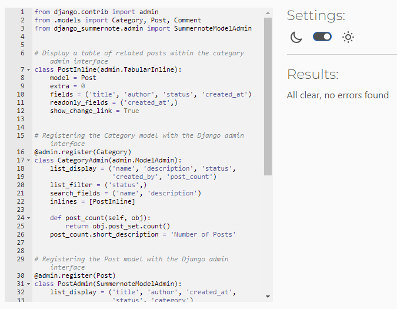

# Urban Biodiversity Platform -  Testing

Visit the deployed site: [Urban Biodiversity Platform](https://ubp-7ea7f2ca1a6d.herokuapp.com/)

Return back to the [README.md](README.md) file.

- - -

## CONTENTS

* [AUTOMATED TESTING](#automated-testing)
  * [Validators](#validators)
  * [Lighthouse](#lighthouse)
  * [Responsiveness](#responsiveness)
  * [Browser Compatibility](#browser-compatibility)

* [MANUAL TESTING](#manual-testing)
  * [Testing User Stories](#testing-user-stories)
  * [Full Testing](#full-testing)

* [BUGS](#bugs)    

Testing was ongoing throughout the entire process of building the project. 
I utilised Chrome developer tools whilst building to pinpoint and troubleshoot any issues as I went along and to check responsivity on a variety of different screen sizes and devices.

- - -

## AUTOMATED TESTING

### Validators

[CI Python Linter](https://pep8ci.herokuapp.com/) was used to validate all the Python files.
[W3C](https://validator.w3.org/) was used to validate the HTML and CSS.
[JSHint](https://jshint.com/) was used to validate the Javascript.

#### CI Python Linter

**`about app`**
File | Screenshot | Notes |
| --- | --- | --- | 
| about/admin.py |  | Passed. No warnings or errors |
| about/apps.py |  | Passed. No warnings or errors |
| about/forms.py |  | Passed. No warnings or errors |
| about/models.py |  | Passed. No warnings or errors |
| about/urls.py |  | Passed. No warnings or errors |
| about/views.py |  | Passed. No warnings or errors |

**`posts app`**
File | Screenshot | Notes |
| --- | --- | --- | 
| posts/admin.py |  | Passed. No warnings or errors |
| posts/apps.py |  | Passed. No warnings or errors |
| posts/constants.py |  | Passed. No warnings or errors |
| posts/decorators.py |  | Passed. No warnings or errors |
| posts/forms.py |  | Passed. No warnings or errors |
| posts/models.py |  | Passed. No warnings or errors |
| posts/urls.py |  | Passed. No warnings or errors |
| posts/views.py |  | Passed. No warnings or errors |

**`ubp`**
File | Screenshot | Notes |
| --- | --- | --- | 
| settings.py |  | Passed. No warnings or errors |
| urls.py |  | Passed. No warnings or errors |
| wsgi.py |  | Passed. No warnings or errors |

#### W3C HTML Validator

Page | Validation PDF | Notes |
| --- | --- | --- |
| **Posts** | [View PDF](https://github.com/KikiBerg/urban-biodiversity-platform/blob/main/documentation/testing/validation/val-html-posts.pdf) | Passed. No warnings or errors |
| **Posts detail** | [View PDF](https://github.com/KikiBerg/urban-biodiversity-platform/blob/main/documentation/testing/validation/val-html-posts-detail.pdf) | Passed. No warnings or errors |
| **About** | [View PDF](https://github.com/KikiBerg/urban-biodiversity-platform/blob/main/documentation/testing/validation/val-html-about.pdf) | Passed. No warnings or errors |
| **Categories** | [View PDF](https://github.com/KikiBerg/urban-biodiversity-platform/blob/main/documentation/testing/validation/val-html-categories.pdf) | Passed. No warnings or errors |
| **Categories post list** (category exists) | [View PDF](https://github.com/KikiBerg/urban-biodiversity-platform/blob/main/documentation/testing/validation/val-html-categories-postlist-exist.pdf) | Passed. No warnings or errors |
| **Categories post list** (category does not exist) | [View PDF](https://github.com/KikiBerg/urban-biodiversity-platform/blob/main/documentation/testing/validation/val-html-categories-postlist-not-exist.pdf) | Passed. No warnings or errors |
| **Categories create** | [View PDF](https://github.com/KikiBerg/urban-biodiversity-platform/blob/main/documentation/testing/validation/val-html-categories-create.pdf) | Passed. No warnings or errors |
| **Categories update** | [View PDF](https://github.com/KikiBerg/urban-biodiversity-platform/blob/main/documentation/testing/validation/val-html-categories-update.pdf) | Passed. No warnings or errors |
| **Categories delete** | [View PDF](https://github.com/KikiBerg/urban-biodiversity-platform/blob/main/documentation/testing/validation/val-html-categories-delete.pdf) | Passed. No warnings or errors |
| **Sign In** | [View PDF](https://github.com/KikiBerg/urban-biodiversity-platform/blob/main/documentation/testing/validation/val-html-signin.pdf) | Passed. No warnings or errors |
| **Sign Up** | [View PDF](https://github.com/KikiBerg/urban-biodiversity-platform/blob/main/documentation/testing/validation/val-html-signup.pdf) | Passed. No warnings or errors |
| **Sign Out** | [View PDF](https://github.com/KikiBerg/urban-biodiversity-platform/blob/main/documentation/testing/validation/val-html-signout.pdf) | Passed. No warnings or errors |
| **404** | [View PDF](https://github.com/KikiBerg/urban-biodiversity-platform/blob/main/documentation/testing/validation/val-html-404.pdf) | Passed. No warnings or errors |

#### W3C CSS Validator

File | Screenshot | Notes |
| --- | --- | --- |
| style.css |  | Passed. No warnings or errors |
| navbar.css |  | Passed. No warnings or errors |
| signup.css |  | Passed. No warnings or errors |

#### JSHint Javascript Validator

File | Screenshot | Notes |
| --- | --- | --- |
| category_status_update.js |  | Warnings about: 'const', 'let in ES6', 'arrow function syntax', 'template literal syntax in ES6'. I ignored these warnings. |

- - -

### Lighthouse

I used Lighthouse within the Chrome Developer Tools to test the performance, accessibility, best practices and SEO of the website.

| Page | Screenshot |
| --- | --- | 
| **Posts** |  | 
| **Posts detail** |  | 
| **About** |  | 
| **Categories** |  | 
| **Categories post list** |  |
| **Categories create** |  | 
| **Categories update** |  |
| **Categories delete** |  |
| **Sign In** |  | 
| **Sign Up** |  | 
| **404** |  |

- - -

### Responsiveness

I have tested my deployed project on multiple devices to check for responsiveness issues. No issues were found.
Apart from the Chrome Devtools, I've used [this site](https://techsini.com/multi-mockup/index.php) to quickly check responsiveness on different devices and get screenshots for the testing.md file.

`Posts Page`
| Screenshot | Notes |
| --- | --- |
| | Works as expected |

`Posts detail Page`
| Screenshot | Notes |
| --- | --- |
| | Works as expected |

`About Page`
| Screenshot | Notes |
| --- | --- |
| | Works as expected |

`Categories Page`
| Screenshot | Notes |
| --- | --- |
| | Works as expected |

`Categories Post List Page`
| Screenshot | Notes |
| --- | --- |
| | Works as expected |

`Sign In Page`
| Screenshot | Notes |
| --- | --- |
| | Works as expected |

`Sign Up Page`
| Screenshot | Notes |
| --- | --- |
| | Works as expected |

`404 Page`
| Screenshot | Notes |
| --- | --- |
| | Works as expected |

- - -

### Browser Compatibility

I have tested my deployed project on two different browsers to check for compatibility issues. I could not find any issues.

| Browser | Main page |
| --- | --- |
| Chrome |  | 
| Edge |  | 

- - -

## MANUAL TESTING

### Testing User Stories

Here's a detailed table for testing the various user stories of the project. The aim is to follow up the functionality implementation.

| User Story ID | Title | Tested? | Response | Pass/Fail |
|---------------|-------|---------|----------|-----------|
| #1 | User Registration | Yes | No issues | Pass |
| #2 | User Registration | Yes | No issues | Pass |
| #3 | User Registration | Yes | No issues | Pass |

- - -

### Full Testing

### Navigation Menu
| Feature            | Tested? | Action        | Expected Outcome | Pass/Fail | Screenshots |
|--------------------|---------|---------------|------------------|-----------|-------|
| Logout Link  | Yes | Click on "Sign Out" in the navigation bar. | User receives confirmation message and is redirected to the main page | Pass  |      |

### Posts page
| Feature            | Tested? | Action        | Expected Outcome | Pass/Fail | Screenshots |
|--------------------|---------|---------------|------------------|-----------|-------|
|--------------------|---------|---------------|------------------|-----------|-------|
|--------------------|---------|---------------|------------------|-----------|-------|
|--------------------|---------|---------------|------------------|-----------|-------|

### Posts detail page
| Feature            | Tested? | Action        | Expected Outcome | Pass/Fail | Screenshots |
|--------------------|---------|---------------|------------------|-----------|-------|
|--------------------|---------|---------------|------------------|-----------|-------|
|--------------------|---------|---------------|------------------|-----------|-------|
|--------------------|---------|---------------|------------------|-----------|-------|
|--------------------|---------|---------------|------------------|-----------|-------|

### About page
| Feature            | Tested? | Action        | Expected Outcome | Pass/Fail | Screenshots |
|--------------------|---------|---------------|------------------|-----------|-------|
|--------------------|---------|---------------|------------------|-----------|-------|
|--------------------|---------|---------------|------------------|-----------|-------|
|--------------------|---------|---------------|------------------|-----------|-------|
|--------------------|---------|---------------|------------------|-----------|-------|

### Categories page
| Feature            | Tested? | Action        | Expected Outcome | Pass/Fail | Screenshots |
|--------------------|---------|---------------|------------------|-----------|-------|
|--------------------|---------|---------------|------------------|-----------|-------|
|--------------------|---------|---------------|------------------|-----------|-------|
|--------------------|---------|---------------|------------------|-----------|-------|
|--------------------|---------|---------------|------------------|-----------|-------|

### Categories post list page
| Feature            | Tested? | Action        | Expected Outcome | Pass/Fail | Screenshots |
|--------------------|---------|---------------|------------------|-----------|-------|
|--------------------|---------|---------------|------------------|-----------|-------|
|--------------------|---------|---------------|------------------|-----------|-------|
|--------------------|---------|---------------|------------------|-----------|-------|
|--------------------|---------|---------------|------------------|-----------|-------|

### Categories create page
| Feature            | Tested? | Action        | Expected Outcome | Pass/Fail | Screenshots |
|--------------------|---------|---------------|------------------|-----------|-------|
|--------------------|---------|---------------|------------------|-----------|-------|
|--------------------|---------|---------------|------------------|-----------|-------|
|--------------------|---------|---------------|------------------|-----------|-------|
|--------------------|---------|---------------|------------------|-----------|-------|

### Categories update page
| Feature            | Tested? | Action        | Expected Outcome | Pass/Fail | Screenshots |
|--------------------|---------|---------------|------------------|-----------|-------|
|--------------------|---------|---------------|------------------|-----------|-------|
|--------------------|---------|---------------|------------------|-----------|-------|
|--------------------|---------|---------------|------------------|-----------|-------|
|--------------------|---------|---------------|------------------|-----------|-------|

### Categories delete page
| Feature            | Tested? | Action        | Expected Outcome | Pass/Fail | Screenshots |
|--------------------|---------|---------------|------------------|-----------|-------|
|--------------------|---------|---------------|------------------|-----------|-------|
|--------------------|---------|---------------|------------------|-----------|-------|
|--------------------|---------|---------------|------------------|-----------|-------|
|--------------------|---------|---------------|------------------|-----------|-------|

### Sign In page
| Feature            | Tested? | Action        | Expected Outcome | Pass/Fail | Screenshots |
|--------------------|---------|---------------|------------------|-----------|-------|
|--------------------|---------|---------------|------------------|-----------|-------|
|--------------------|---------|---------------|------------------|-----------|-------|
|--------------------|---------|---------------|------------------|-----------|-------|
|--------------------|---------|---------------|------------------|-----------|-------|

### Sign Up page
| Feature            | Tested? | Action        | Expected Outcome | Pass/Fail | Screenshots |
|--------------------|---------|---------------|------------------|-----------|-------|
|--------------------|---------|---------------|------------------|-----------|-------|
|--------------------|---------|---------------|------------------|-----------|-------|
|--------------------|---------|---------------|------------------|-----------|-------|
|--------------------|---------|---------------|------------------|-----------|-------|

### 404 page
| Feature            | Tested? | Action        | Expected Outcome | Pass/Fail | Screenshots |
|--------------------|---------|---------------|------------------|-----------|-------|
|--------------------|---------|---------------|------------------|-----------|-------|
|--------------------|---------|---------------|------------------|-----------|-------|
|--------------------|---------|---------------|------------------|-----------|-------|
|--------------------|---------|---------------|------------------|-----------|-------|

- - -

### Bugs