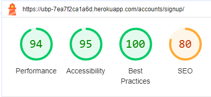
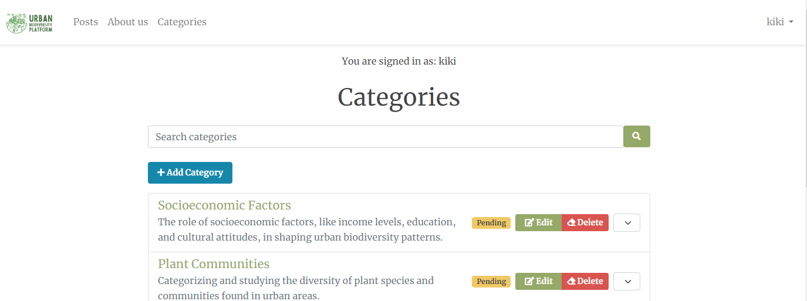
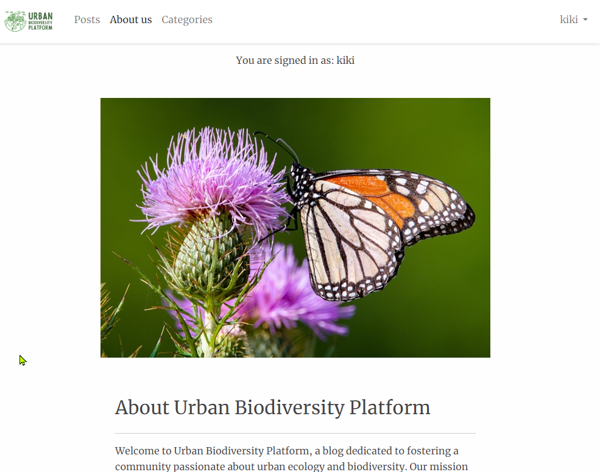
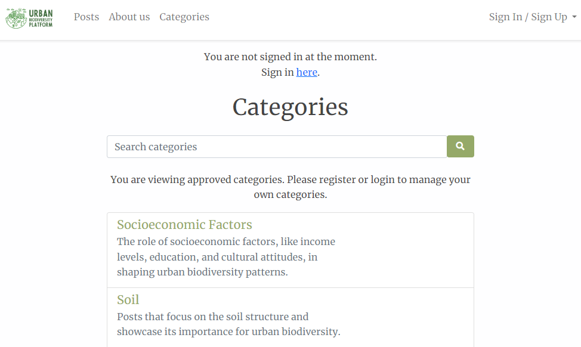

# Urban Biodiversity Platform -  Testing

Visit the deployed site: [Urban Biodiversity Platform](https://ubp-7ea7f2ca1a6d.herokuapp.com/)

Return back to the [README.md](README.md) file.

- - -

## AUTOMATED TESTING

### Code Validation

- [CI Python Linter](https://pep8ci.herokuapp.com/) was used to validate all the Python files.
- [W3C](https://validator.w3.org/) was used to validate the HTML and CSS.
- [JSHint](https://jshint.com/) was used to validate the Javascript.

#### CI Python Linter

**`about app`**
File | Screenshot | Notes |
| --- | --- | --- | 
| about/admin.py |  | Passed. No warnings or errors |
| about/apps.py |  | Passed. No warnings or errors |
| about/forms.py |  | Passed. No warnings or errors |
| about/models.py |  | Passed. No warnings or errors |
| about/urls.py |  | Passed. No warnings or errors |
| about/views.py |  | Passed. No warnings or errors |

**`posts app`**
File | Screenshot | Notes |
| --- | --- | --- | 
| posts/admin.py |  | Passed. No warnings or errors |
| posts/apps.py |  | Passed. No warnings or errors |
| posts/constants.py |  | Passed. No warnings or errors |
| posts/decorators.py |  | Passed. No warnings or errors |
| posts/forms.py |  | Passed. No warnings or errors |
| posts/models.py |  | Passed. No warnings or errors |
| posts/urls.py |  | Passed. No warnings or errors |
| posts/views.py |  | Passed. No warnings or errors |

**`ubp`**
File | Screenshot | Notes |
| --- | --- | --- | 
| settings.py |  | Passed. No warnings or errors |
| urls.py |  | Passed. No warnings or errors |
| wsgi.py |  | Passed. No warnings or errors |

#### W3C HTML Validator

Page | Validation PDF | Notes |
| --- | --- | --- |
| **Posts** | [View PDF](https://github.com/KikiBerg/urban-biodiversity-platform/blob/main/documentation/testing/validation/val-html-posts.pdf) | Passed. No warnings or errors |
| **Posts detail** | [View PDF](https://github.com/KikiBerg/urban-biodiversity-platform/blob/main/documentation/testing/validation/val-html-posts-detail.pdf) | Passed. No warnings or errors |
| **About** | [View PDF](https://github.com/KikiBerg/urban-biodiversity-platform/blob/main/documentation/testing/validation/val-html-about.pdf) | Passed. No warnings or errors |
| **Categories** | [View PDF](https://github.com/KikiBerg/urban-biodiversity-platform/blob/main/documentation/testing/validation/val-html-categories.pdf) | Passed. No warnings or errors |
| **Categories post list** (category exists) | [View PDF](https://github.com/KikiBerg/urban-biodiversity-platform/blob/main/documentation/testing/validation/val-html-categories-postlist-exist.pdf) | Passed. No warnings or errors |
| **Categories post list** (category does not exist) | [View PDF](https://github.com/KikiBerg/urban-biodiversity-platform/blob/main/documentation/testing/validation/val-html-categories-postlist-not-exist.pdf) | Passed. No warnings or errors |
| **Categories create** | [View PDF](https://github.com/KikiBerg/urban-biodiversity-platform/blob/main/documentation/testing/validation/val-html-categories-create.pdf) | Passed. No warnings or errors |
| **Categories update** | [View PDF](https://github.com/KikiBerg/urban-biodiversity-platform/blob/main/documentation/testing/validation/val-html-categories-update.pdf) | Passed. No warnings or errors |
| **Categories delete** | [View PDF](https://github.com/KikiBerg/urban-biodiversity-platform/blob/main/documentation/testing/validation/val-html-categories-delete.pdf) | Passed. No warnings or errors |
| **Sign In** | [View PDF](https://github.com/KikiBerg/urban-biodiversity-platform/blob/main/documentation/testing/validation/val-html-signin.pdf) | Passed. No warnings or errors |
| **Sign Up** | [View PDF](https://github.com/KikiBerg/urban-biodiversity-platform/blob/main/documentation/testing/validation/val-html-signup.pdf) | Passed. No warnings or errors |
| **Sign Out** | [View PDF](https://github.com/KikiBerg/urban-biodiversity-platform/blob/main/documentation/testing/validation/val-html-signout.pdf) | Passed. No warnings or errors |
| **404** | [View PDF](https://github.com/KikiBerg/urban-biodiversity-platform/blob/main/documentation/testing/validation/val-html-404.pdf) | Passed. No warnings or errors |

#### W3C CSS Validator

File | Screenshot | Notes |
| --- | --- | --- |
| style.css |  | Passed. No warnings or errors |
| navbar.css |  | Passed. No warnings or errors |
| signup.css |  | Passed. No warnings or errors |

#### JSHint Javascript Validator

File | Screenshot | Notes |
| --- | --- | --- |
| category_status_update.js |  | Warnings about: 'const', 'let in ES6', 'arrow function syntax', 'template literal syntax in ES6'. I ignored these warnings. |

- - -

### Lighthouse

I used Lighthouse within the Chrome Developer Tools to test the performance, accessibility, best practices and SEO of the website.

| Page | Screenshot |
| --- | --- | 
| **Posts** |  | 
| **Posts detail** |  | 
| **About** |  | 
| **Categories** |  | 
| **Categories post list** |  |
| **Categories create** |  | 
| **Categories update** |  |
| **Categories delete** |  |
| **Sign In** |  | 
| **Sign Up** |  | 
| **Sign Out** |  |
| **404** |  |

- - -

### Responsiveness

I have tested my deployed project on multiple devices to check for responsiveness issues. No issues were found.
Apart from the Chrome Devtools, I've used [this site](https://techsini.com/multi-mockup/index.php) to quickly check responsiveness on different devices and get screenshots for the testing.md file.

`Posts Page`
| Screenshot | Notes |
| --- | --- |
| | Works as expected |

`Posts detail Page`
| Screenshot | Notes |
| --- | --- |
| | Works as expected |

`About Page`
| Screenshot | Notes |
| --- | --- |
| | Works as expected |

`Categories Page`
| Screenshot | Notes |
| --- | --- |
| | Works as expected |

`Categories Post List Page`
| Screenshot | Notes |
| --- | --- |
| | Works as expected |

`Sign In Page`
| Screenshot | Notes |
| --- | --- |
| | Works as expected |

`Sign Up Page`
| Screenshot | Notes |
| --- | --- |
| | Works as expected |

`404 Page`
| Screenshot | Notes |
| --- | --- |
| | Works as expected |

- - -

### Browser Compatibility

I have tested my deployed project on two different browsers to check for compatibility issues. I could not find any issues.

| Browser | Main page |
| --- | --- |
| Chrome |  | 
| Edge |  | 

- - -

## MANUAL TESTING

### Testing User Stories

Here's a detailed table for testing the various user stories of the project. The aim is to follow up the functionality implementation.

| User Story ID | Title | Tested? | Response | Pass/Fail |
|---------------|-------|---------|----------|-----------|
| #1 | User Registration | Yes | No issues | Pass |
| #2 | User Registration | Yes | No issues | Pass |
| #3 | User Registration | Yes | No issues | Pass |

- - -

### Defensive Programming

#### Navigation Menu
| Feature | Tested? | Action | Expected Outcome | Pass/Fail | Screenshots |
| --- | --- | --- | --- | --- | --- | 
| Sign In Link | Yes | Click on "Sign In" from the dropdown menu | User is redirected to the Sign In page, displaying the Sign In form. | Pass ||
| Sign Up Link | Yes | Click on "Sign Up" from the dropdown menu | User is redirected to the Sign Up page, displaying the Sign Up form. | Pass ||
| Sign Out Link | Yes | Click on "Sign Out" from the dropdown menu (that should now show the user's name) | User is redirected to the Sign Out page, displaying the Sign Out button. | Pass ||
| Posts Link | Yes | Click on "Posts" in the navigation bar | User is redirected to the Posts main page, displaying the list of posts. | Pass ||
| About us Link | Yes | Click on "About us" in the navigation bar | User is redirected to the About page. | Pass ||
| Categories Link | Yes | Click on "Categories" in the navigation bar | User is redirected to the Categories page. | Pass ||

#### Posts page
| Feature | Tested? | Action | Expected Outcome | Pass/Fail | Screenshots |
| --- | --- | --- | --- | --- | --- | 
| Posts List | Yes | Click on "Posts" in the navigation bar | User is directed to the posts list page | Pass ||
| Post Title Link | Yes | Click on a post title link | User is redirected to the post detail page of that post | Pass ||
| Post Metadata | Yes | Navigate to the posts page | The author & last updated date are displayed below the title. | Pass ||
| Post Excerpt | Yes | Navigate to the posts page | The excerpt of the post is displayed below the metadata. | Pass ||
| Pagination - Page Links  | Yes | Navigate through the page links in the pagination section |  The correct page of posts is displayed when clicking on each page number  | Pass ||
| Pagination - First Page | Yes | Navigate to the Posts page, ensure the first page is displayed |  The pagination "cancels" the "Previous" button & activates (blue color) the "Next" button.  | Pass ||
| Pagination - Last Page | Yes | Navigate to the Posts page, ensure the last page is displayed |  The pagination "cancels" the "Next" button & activates (blue color) the "Previous" button.  | Pass ||

#### Posts detail page
| Feature | Tested? | Action | Expected Outcome | Pass/Fail | Screenshots |
| --- | --- | --- | --- | --- | --- | 
| Page Title | Yes | Navigate to a post detail page | The page title should be the title of the post | Pass |  |  
| Post Featured Image | Yes | Verify a post with a featured image displays the correct image | The featured image is displayed for the post | Pass |  |  
| Post Metadata | Yes | Navigate to a post detail page | The author, last updated date & category are displayed below the title. | Pass |  |
| Post Content | Yes | Navigate to a post detail page | The full post content is displayed. | Pass |  |
| Comments Counting | Yes | Navigate to the end of a post content | The number of comments is displayed. | Pass |  |
| New Comment Form | Yes | Register, sign in & navigate to a post detail page | The new comment form is displayed, allowing the logged-in user to submit a comment | Pass |  |
| Comment Restrictions for registered users | Yes | Register, sign in & navigate to a post detail page | You should only be able to see the approved comments, marked with a green color. You should be able to see an update & delete button for your own comments. | Pass |  |
| Comment Restrictions for admin | Yes | Sign in as admin | You should be able to see all comments regardless status. The approved should be marked with a green color & the pending should be marked with a yellow color. | Pass |  |
| Comment Restrictions for non-registered users | Yes | Navigate to the comments section at the end of a post detail page | You should be able to see only the approved comments & not have the ability to leave a comment. A card shows that informs you of your auth status and giving you the link to the sign in page | Pass |  |
| Comment Submission for registered users | Yes | Submit a new comment as a logged-in user | A message shows that the comment is submitted & awaiting approval. | Pass |  |
| Comment Submission for admin | Yes | Submit a new comment as admin | Same message as above shows. You should also be able to see your new comment marked with a yellow (appending) color | Pass |  |
| Comment Update | Yes | Direct to a comment you left as admin or logged in user & click on the update button | A form appears for editing the comment | Pass |  |
| Comment Update Message | Yes | As admin or logged in user update your comment in the update form & click on the Update button | A message appears that the comment is updated & waiting approval | Pass |  |
| Comment Delete | Yes | Direct to a comment you left as admin or logged in user & click on the delete button | You get directed to a page asking you to confirm the deletion of the comment | Pass |  |

#### About page
| Feature | Tested? | Action | Expected Outcome | Pass/Fail | Screenshots |
| --- | --- | --- | --- | --- | --- | 
| About Us Content | Yes | Navigate to the "About Us" page | The full "About Us" content is displayed | Pass | |
| Contact Us Form | Yes | Scroll down to the Let's Connect form | The Contact Us form is displayed, allowing the user to submit messages to the admins. | Pass | |
| Submit Contact Us Form | Yes | Fill out and click on the submit button | The form is successfully submitted, and a confirmation message is displayed. | Pass | |

#### Categories page
| Feature | Tested? | Action | Expected Outcome | Pass/Fail | Screenshots |
| --- | --- | --- | --- | --- | --- | 
| Categories List | Yes | Click on "Categories" in the navigation bar | User is directed to the categories list page | Pass ||
| Categories Title & Description | Yes | Direct to the Categories page | You should be able to see the list of categories along with the title and the description of the category below the title | Pass ||
| Categories Title Link | Yes | Click on a category | You are directed to the category postlist page | Pass ||
| Categories Search form | Yes | Type some search words for a category | If matching, you are directed to a filtered page showing the relevant category | Pass ||
| Categories for admin | Yes | Sign in as admin & navigate to the Categories page | You are able to see all categories regardless status | Pass ||
| Categories editing for admin | Yes | Click the edit button | You are directed to an update page & can update the category | Pass ||
| Categories deleting for admin | Yes | Click the edit button | You are directed to a delete page & can delete the category | Pass ||
| Categories status for admin | Yes | Click the dropdown button next to the delete button | You can change the status of the category from the dropdown menu | Pass ||
| --- | --- | --- | --- | --- | --- |
| Pagination - Page Links  | Yes | Navigate through the page links in the pagination section |  The correct page of categories list is displayed when clicking on each page number  | Pass ||
| Pagination - First Page | Yes | Navigate to the Categories page, ensure the first page is displayed |  The pagination "cancels" the "Previous" button & activates (blue color) the "Next" button.  | Pass ||
| Pagination - Last Page | Yes | Navigate to the Categories page, ensure the last page is displayed |  The pagination "cancels" the "Next" button & activates (blue color) the "Previous" button.  | Pass ||

#### Categories post list page
| Feature | Tested? | Action | Expected Outcome | Pass/Fail | Screenshots |
| --- | --- | --- | --- | --- | --- | 

#### Categories create page
| Feature | Tested? | Action | Expected Outcome | Pass/Fail | Screenshots |
| --- | --- | --- | --- | --- | --- | 
| Categories Create for admin | Yes | Direct to the Categories page & click on "Add Categories" | The admin is directed to the categories create page & can see a Category Creation form consisting of 3 fields (Name, Description, Status)  | Pass ||
| Categories Create Success for admin | Yes | Create a new category by filling out the fields & click on "Save" | The admin is directed to the categories list page & can see the new category with a message of awaiting approval | Pass ||

#### Categories update page
| Feature | Tested? | Action | Expected Outcome | Pass/Fail | Screenshots |
| --- | --- | --- | --- | --- | --- | 

#### Categories delete page
| Feature | Tested? | Action | Expected Outcome | Pass/Fail | Screenshots |
| --- | --- | --- | --- | --- | --- | 
| Categories Delete for admin | Yes | Choose a category & click on "Delete" | The admin is directed to a categories delete page & can see a warning & a "Confirm Delete" & "Cancel" buttons | Pass ||

#### Sign In page
| Feature | Tested? | Action | Expected Outcome | Pass/Fail | Screenshots |
| --- | --- | --- | --- | --- | --- | 
| Sign In form | Yes | Fill out the form with valid data and click the "Sign In" button. | The form is submitted and the user is signed in and redirected to the main posts page. A success message appears. | Pass | |

#### Sign Up page
| Feature | Tested? | Action | Expected Outcome | Pass/Fail | Screenshots |
| --- | --- | --- | --- | --- | --- | 
| Informative Text | Yes | Click on "Sign Up" in the navbar | A message informing that the user is not signed in appears. The sign up form appears. | Pass | | 
| Username Field | Yes | Enter a username, fill up the rest of the form and click "Sign Up" | The username is accepted, or an error message is displayed if invalid. | Pass | |
| Success message | Yes | No action needed | A success message appears confirming that the user has signed up and that they're logged in | Pass | |

#### Sign Out page
| Feature | Tested? | Action | Expected Outcome | Pass/Fail | Screenshots |
| --- | --- | --- | --- | --- | --- |
| Confirmation Text | Yes | Click on "Sign Out" | A message asking the user if they're sure they want to sign out appears | Pass | |
| User Sign Out | Yes | Click on "Sign Out" button | User is signed out and redirected to the main posts page. A message confirming the signing out appears | Pass |  |

#### 404 page
| Feature | Tested? | Action | Expected Outcome | Pass/Fail | Screenshots |
| --- | --- | --- | --- | --- | --- |
| Error 404 not found (Categories page) | Yes | Search for a random category in the search form | An informative 404 message should appear | Pass |  | 
| Go to Homepage button | Yes | Click the button | User is redirected to the main posts page | Pass |  |
| Return to Categories button | Yes | Click the button | User is redirected to the categories page | Pass |  |

- - -

### Bugs